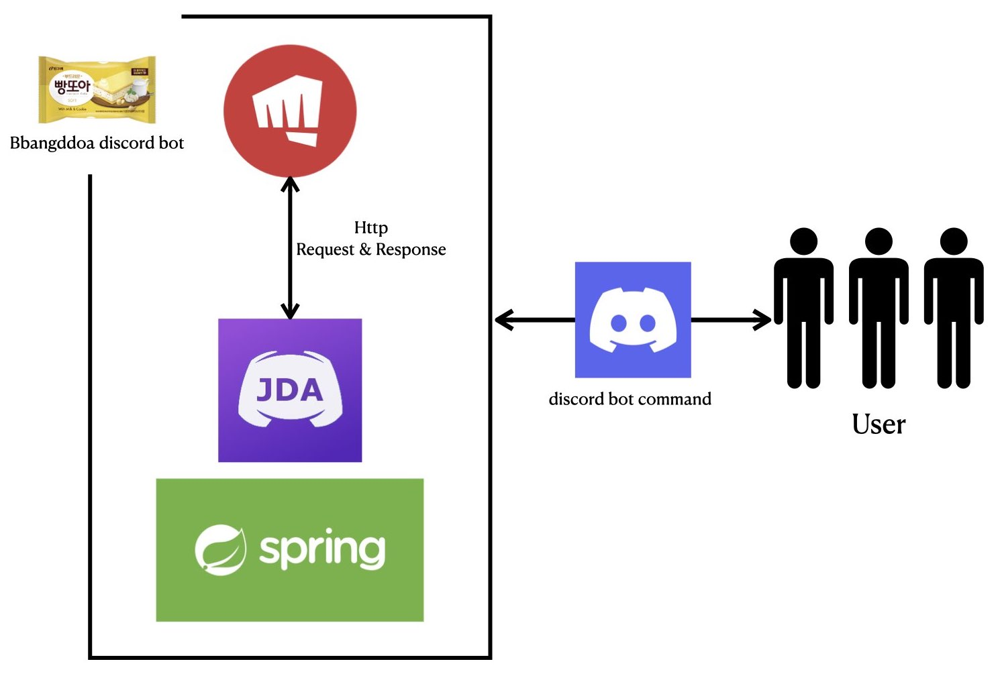
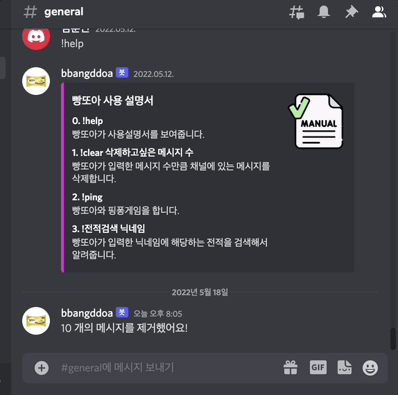
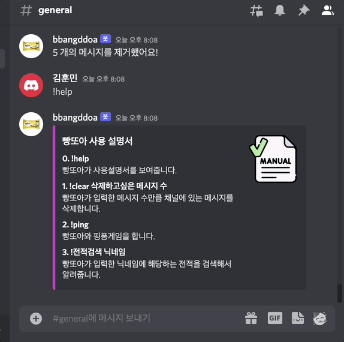
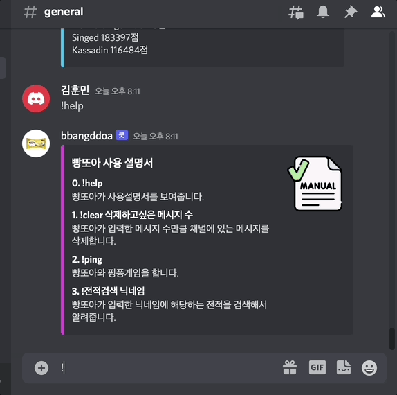

## Bbangddoa discord bot 🎮
- 빵또아 디스코드 봇
- 특정 명령어를 통해 리그오브레전드 게임 전적검색을 디스코드 봇을 통해서 편리하게 할 수 있습니다.

 

## Project
#### 기간
- 2022년 4월 8일 ~ 2022년 5월 28일

#### 프로젝트 인원
- 1명

#### backend
  

#### API
 
- Riot API
- JDA (Java Discord API)

 

## 프로젝트 전체 구조

## 기능
### 1. help command

#### `!help` 를 입력하면 봇이 사용자에게 빵또아 디스코드 봇 사용설명 방법을 알려줍니다.

 

### 2. clear command

#### `!clear n` 를 입력하면 봇이 채널내의 n개의 메시지를 삭제합니다.

 

## 3. ping command

#### `!ping` 를 입력하면 봇이 pong이라고 대답합니다.

 

## 4. search lol record command

#### `!전적검색 닉네임` 을 입력하면 봇이 해당 닉네임으로 전적검색을 하고 사용자에게 해당 유저의 정보를 알려줍니다.

 

## Reference

#### • JDA (Java Discord API) : https://github.com/DV8FromTheWorld/JDA
#### • Riot API : https://developer.riotgames.com

