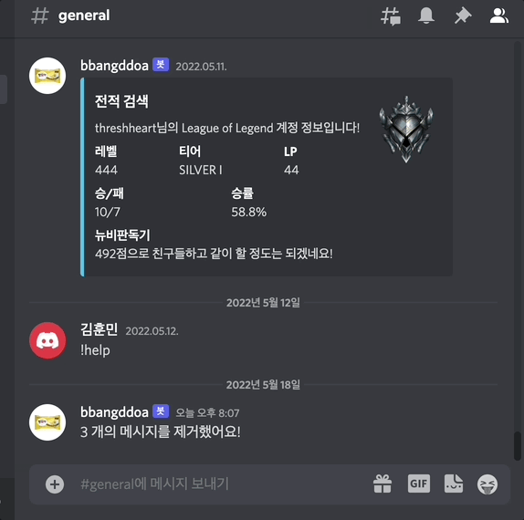

# bbangddoa discord bot
Bbangddoa is a discord bot with various convenience functions

# How does it works?

# Functions
## 1. help command

### bot will show you the user's manual for using Bbangddoa

 

## 2. clear command

### bot will erases the discode message as many times as you enter it

 

## 3. ping command

### bot will play ping pong game with you

 

## 4. search lol record command

### bot will shows the record of the league of legends of the nickname you entered

 

# Tech Stack

  
  
  
  

#### • Programming Language : Java 11.0.14
#### • IDE : IntelliJ IDEA 2021.3.3
#### • Gradle 5.6.2

# API

  
  
  

#### • Riot API
#### • JDA (Java Discord API)

# Reference

#### • JDA (Java Discord API) : https://github.com/DV8FromTheWorld/JDA
#### • Riot API : https://developer.riotgames.com

